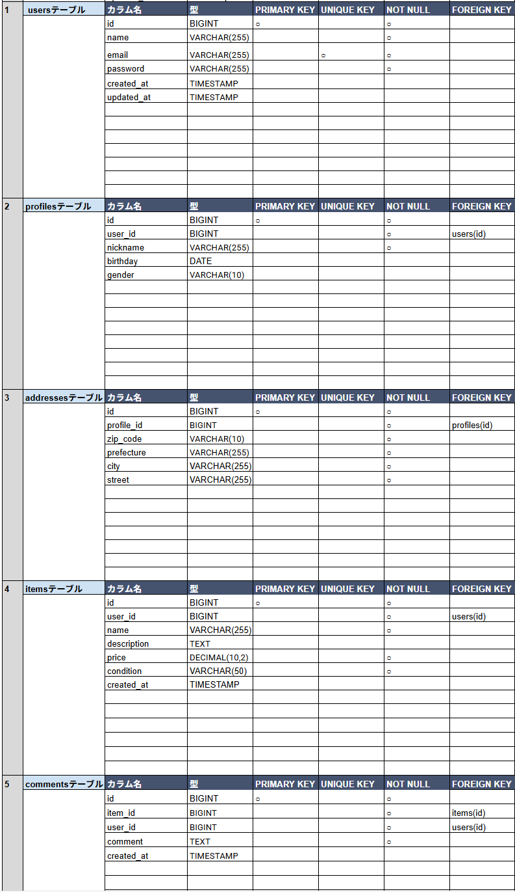
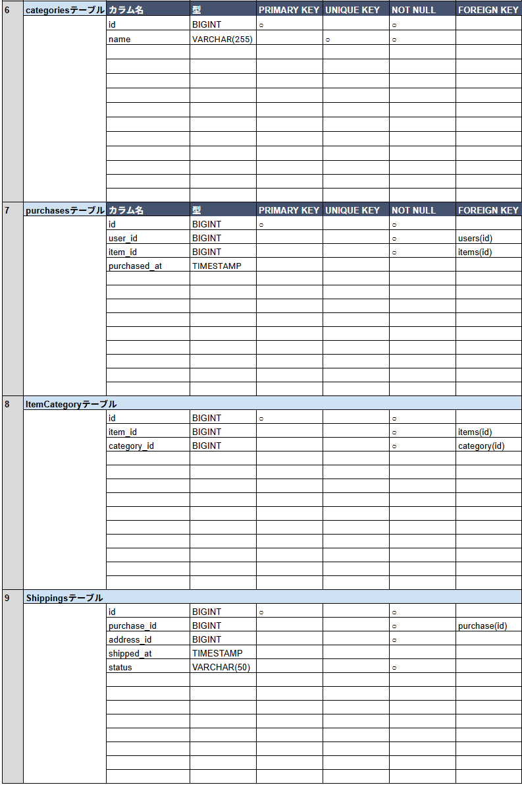
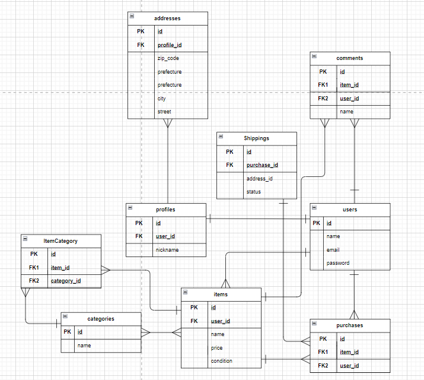

# coachtechフリマ
---
## 環境構築
---
#### Dockerビルド
  1. git clone git@github.com:yumi0217/coachtech-furima-test.git
  2. cd coachtech-furima-test
  3. DockerDesktopアプリを立ち上げる
  4. docker-compose up -d --build
#### Laravel環境構築
  1. docker-compose exec php bash
  2. composer install
  3. 「.env.example」ファイルを 「.env」ファイルに命名を変更。または、新しく.envファイルを作成
  4. .envに以下の環境変数を追加
```
DB_CONNECTION=mysql
DB_HOST=mysql
DB_PORT=3306
DB_DATABASE=laravel_db
DB_USERNAME=laravel_user
DB_PASSWORD=laravel_pass
``` 
  5. アプリケーションキーの作成
```
php artisan key:generate
```
  6. マイグレーションの実行
```
php artisan migrate
```
  7. シーディングの実行
```
php artisan db:seed
```
### ダミーデータの生成に使われるファイル
- `ItemFactory.php`：商品データのランダム生成に使用（ファクトリ経由で自動生成）
- `ItemsTableSeeder.php`：初期の商品データ10件を手動で挿入
- `UsersTableSeeder.php`：テスト用の出品者・購入者などのダミーユーザーを登録
- `CommentsTableSeeder.php`：コメント欄の動作確認用に、ダミーコメントを登録

### DatabaseSeeder.php 内容
```
public function run()
    {
        $this->call([
            UsersTableSeeder::class,
            ItemsTableSeeder::class,
            CommentsTableSeeder::class,
        ]);
    }
```


  8. シンボリックリンク作成
```
php artisan storage:link
```
###  出品画像・プロフィール画像の保存先

- 出品画像は `storage/app/public/items/` に保存されます。  
  `php artisan storage:link` を実行することで、`public/storage/items/` から画像が参照可能になります。

- プロフィール画像は `storage/app/public/profile_images/` に保存されます。  
  同様に、`public/storage/profile_images/` からアクセス可能になります。

---

###  ダミーユーザー画像についての注意

- ダミーユーザーに設定されたプロフィール画像ファイル（例：`miyo.png`、`ichiro.png` など）は、以下のディレクトリに事前に配置しておいてください：
public/storage/profile_images/

※ `php artisan storage:link` を実行済みであれば、  
　 ブラウザから `public/storage/profile_images/` 経由で画像が表示されます。

## 認証機能
---
Laravel Fortify を使用して以下の機能を実装しています：

- 会員登録
- ログイン／ログアウト
- プロフィール情報の更新
- パスワード変更
  9. Fortify のインストール
```
composer require laravel/fortify
```
  10. Fortify の設定ファイルを公開
```
php artisan vendor:publish --provider="Laravel\Fortify\FortifyServiceProvider"
```
  11. config/fortify.php の設定確認・編集（機能の有効化）
```
'features' => [
    Features::registration(),
    Features::resetPasswords(),
    Features::updateProfileInformation(),
    Features::updatePasswords(),
],
```
  12. FortifyServiceProviderの設定
```
Fortify::loginView(function () {
    return view('auth.login');
});

Fortify::registerView(function () {
    return view('auth.register');
});

Fortify::verifyEmailView(function () {
    return view('auth.verify');
});
```

## テストログイン情報（ダミーユーザー）
---

| 役割   | メールアドレス         | パスワード  | 備考               |
|--------|------------------------|-------------|--------------------|
| 出品者 | seller@example.com     | password    | 商品の出品・編集が可能 |
| 購入者 | buyer@example.com      | password    | 商品の購入・コメントが可能 |

## 使用技術(実行環境)
---
  - PHP8.3.0
  - Laravel8.83.27
  - MySQL8.0.26 
  - mailpit（開発中のメール確認ツール,会員登録する際は開いておく必要あり！）
  - JavaScript（画像プレビュー機能、カスタムUIに使用）
  - Bladeテンプレートエンジン（ビュー構築）
  - CSS（デザインカスタマイズ）
  - Eloquent ORM（モデルとDBの連携）
  - Stripe API（機能要件にある通り今回は接続のみ）

### .env に以下を追記（Stripeのテストキー）：
---
STRIPE_SECRET=sk_test_各自のテスト用シークレットキー
STRIPE_PUBLIC=pk_test_各自のテスト用パブリックキー
※各自取得してください

## メール確認
---
- mailpit: http://localhost:8025

## テーブル設計
---



## ER図
---

## URL
---
  - 開発環境：http://localhost/
  - phpMyAdmin:：http://localhost:8080/